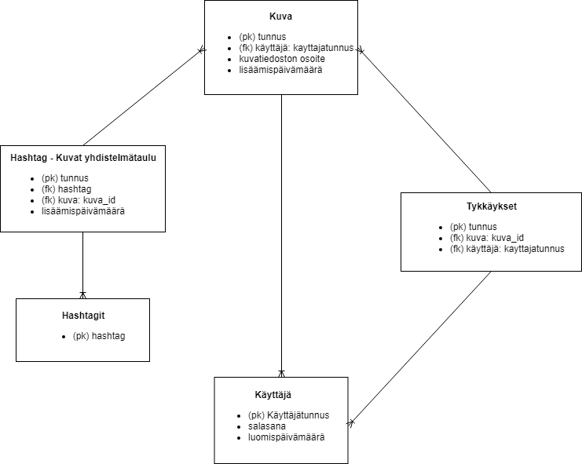

# Valokuvagalleria-tietokantasovellus-koulu
Tietojenkäsittelytieteen Tietokantasovellus -kurssille tehty harjoitustyö (school project)

Harjoitustyössä tehdään valokuvagalleria sovellus, johon käyttäjät voivat lisätä ja poistaa kuvia, sekä muokata niiden tietoja. Sovelluksen käyttäjät luovat itselleen tunnukset sovellukseen, ja voivat tämän jälkeen lisätä/poistaa kuvia sovelluksesta. Kuvista tallennetaan tietoina itse kuvatiedosto, päivämäärätieto, hashtagit. Lisäksi muut rekisteröityneet käyttäjät voivat käydä tykkäämässä toisten lisäämistä kuvista. Käyttäjä voi tykätä yhdesta kuvasta vain kerran. Kuvissa näkyy kuinka monta henkilöä on tykännyt kyseisestä kuvasta. Ei-rekisteröityneet käyttäjät näkevät kaikki kuvat, mutta eivät voi lisätä omia kuviaan, tai tykätä muiden kuvista. 

Kuvia voidaan suodattaa hashtagien/päivämäärän/käyttäjän mukaan. Kuvat tulevat oletusarvoisesti tykätyimmät kuvat ensin, mutta kuvat voidaan myös järjestää päinvastaiseen järjestykseen, eli vähiten tykätty kuva ensin.

Toimintoja:
- Kirjautuminen
- Kuvan lisäys ja poisto
- Kuvien tietojen muokkaus (päivämäärä, hashtag)
- Kuvista tykkääminen (monesta moneen taulu)
- Etusivun kuvasuodatus hakukriteerien perusteella

## Tietokantakaavio

