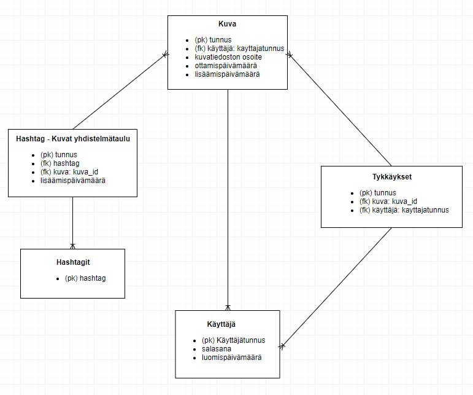

# Valokuvagalleria-tietokantasovellus-koulu
Tietojenkäsittelytieteen Tietokantasovellus -kurssille tehty harjoitustyö (school project)

Harjoitustyössä tehdään valokuvagalleria sovellus, johon käyttäjät voivat lisätä ja poistaa kuvia, sekä muokata kuvan ottamispäivämäärä tietoa. Sovelluksen käyttäjät luovat itselleen tunnukset sovellukseen, ja voivat tämän jälkeen lisätä/poistaa kuvia sovelluksesta. Kuvista tallennetaan tietoina itse kuvatiedosto, päivämäärätieto, hashtagit. Lisäksi muut rekisteröityneet käyttäjät voivat käydä tykkäämässä toisten lisäämistä kuvista. Käyttäjä voi tykätä yhdesta kuvasta vain kerran. Kuvissa näkyy kuinka monta henkilöä on tykännyt kyseisestä kuvasta. Ei-rekisteröityneet käyttäjät näkevät kaikki kuvat, mutta eivät voi lisätä omia kuviaan, tai tykätä muiden kuvista. 

Kuvia voidaan suodattaa hashtagien/päivämäärän/käyttäjän mukaan. Kuvat tulevat oletusarvoisesti tykätyimmät kuvat ensin, mutta kuvat voidaan myös järjestää päinvastaiseen järjestykseen, eli vähiten tykätty kuva ensin.

## [Linkki Herokun live-versioon](https://tietokanta-harjoitustyo.herokuapp.com/)

### Toimintoja:
- Kirjautuminen. 
- Kuvan lisäys ja poisto. 
- Kuvien tietojen muokkaus (päivämäärä, hashtag)
- Kuvista tykkääminen (monesta moneen taulu)
- Etusivun kuvasuodatus hakukriteerien perusteella

### User Storyt
- Sivun kävijänä näen listan kaikista kuvista, niiden ottamisajankohdasta, tykkäyksistä ja hashtageistä
- Uutena käyttäjänä voin luoda itselleni uuden tilin
- Uutena käyttäjänä en voi luoda tiliä samalla käyttäjänimellä, joka on jo kannassa
- Käyttäjänä voin kirjautua sisään applikaatioon
- Käyttäjänä voin kirjautua ulos applikaatiosta
- Sisäänkirjautuneena käyttäjänä voin lisätä kuvan
- Sisäänkirjautuneena käyttäjänä voin poistaa oman aikaisemmin lisäämäni kuvan
- Sisäänkirjautuneena käyttäjänä voin lisätä kuvalle kuvan ottamispäivämäärän
- Sisäänkirjautuneena käyttäjänä voin lisätä kuvalle hashtagin
- Sisäänkirjautuneena käyttäjänä en voi lisätä kuvalle samaa hashtagia useampaa kertaa
- Sisäänkirjautuneena käyttäjänä en voi lisätä muiden kuville hashtagejä
- Sisäänkirjautuneena käyttäjänä en voi poistaa muiden kuvia käyttäjien kuvia
- Sisäänkirjautuneena käyttäjänä voin muokata lisäämäni kuvan ottamispäivämäärää
- Sisäänkirjautuneena käyttäjänä voin muokata lisäämäni kuvan hashtagejä
- Sisäänkirjautuneena käyttäjänä voin tykätä kuvista
- Sisäänkirjautuneena käyttäjänä voin tykätä kuvasta vain kerran
- Sisäänkirjautuneena käyttäjänä voin poistaa tykkäykseni

## Tietokantakaavio

