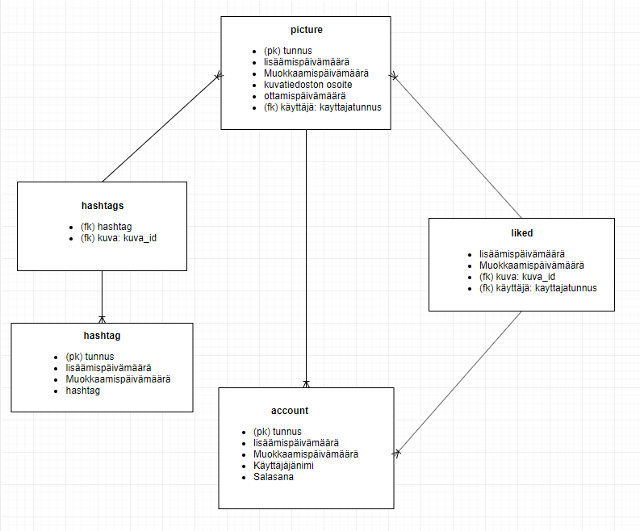

# Valokuvagalleria-tietokantasovellus-koulu
Tietojenkäsittelytieteen Tietokantasovellus -kurssille tehty harjoitustyö (school project)

Harjoitustyössä tehdään valokuvagalleria sovellus, johon käyttäjät voivat lisätä ja poistaa kuvia, sekä muokata kuvan ottamispäivämäärä tietoa. Sovelluksen käyttäjät luovat itselleen tunnukset sovellukseen, ja voivat tämän jälkeen lisätä/poistaa kuvia sovelluksesta. Kuvista tallennetaan tietoina itse kuvatiedosto, päivämäärätieto, hashtagit. Lisäksi muut rekisteröityneet käyttäjät voivat käydä tykkäämässä toisten lisäämistä kuvista. Käyttäjä voi tykätä yhdesta kuvasta vain kerran. Kuvissa näkyy kuinka monta henkilöä on tykännyt kyseisestä kuvasta. Ei-rekisteröityneet käyttäjät näkevät kaikki kuvat, mutta eivät voi lisätä omia kuviaan, tai tykätä muiden kuvista. 

Kuvia voidaan suodattaa hashtagien tai käyttäjän mukaan. 

Applikaatio on tehty käyttäen Pythonin Flask -kirjastoa, SQLAlchemyä ja frontendin puolella Bootsrap -kirjastoa.

## [Linkki Herokun live-versioon](https://tietokanta-harjoitustyo.herokuapp.com/)

### Toimintoja:
- Kirjautuminen. Testitunnukset käyttäjätunnus: Testi, salasana: Testi
- Kuvan lisäys ja poisto. 
- Kuvien tietojen muokkaus (päivämäärä, hashtag)
- Kuvista tykkääminen (monesta moneen taulu)
- Etusivun kuvasuodatus hakukriteerien perusteella

[Linkki UserStoreihin](documentation/UserStories.md)

[Linkki User Manualiin](documentation/usermanual.md)

[Linkki Instruction Manualiin](documentation/installation.md)

[Linkki Restrictions and Future ideas -osioon](documentation/restrictionsAndFutureIdeas.md)

[Linkki Tietorakenteen kuvaukseen](documentation/DataBaseStructure.md)

## Tietokantakaavio

